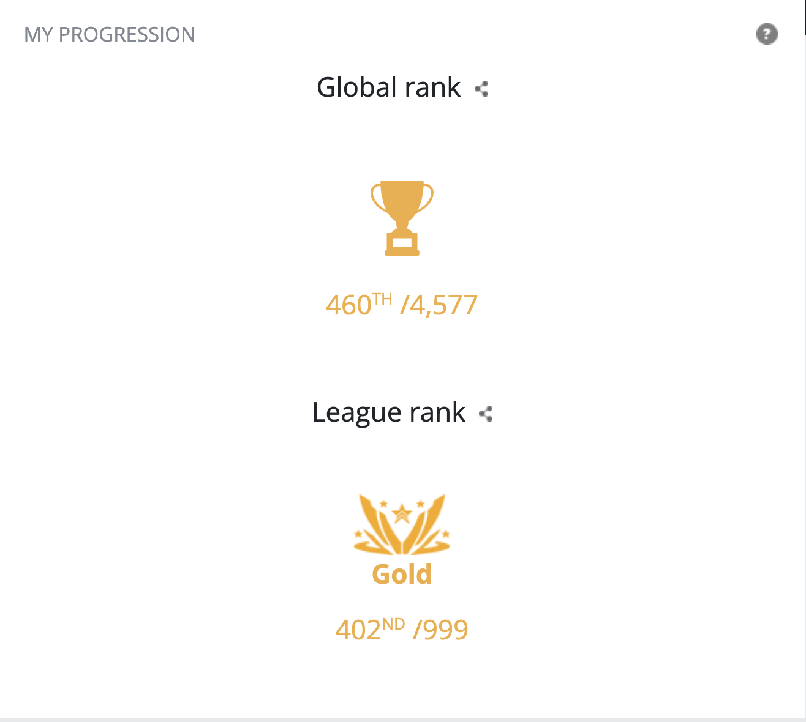

# Codingame Challenge 2022 - Rank 420 Worldwide 🚀

## Overview
I participated in the Codingame Challenge 2022 and achieved a global ranking of 420! It was an exciting experience and I'm thrilled to share my journey with you.

## About the Challenge
The Codingame Challenge 2022 was a global coding competition where participants tackled various algorithmic and programming challenges. It provided a platform for coders to showcase their skills, compete against others worldwide, and learn from each other.

## My Rank
- **Global Rank:** 420
- **Country Rank:** [Your Country Rank]
- **Points:** [Your Points]

## Screenshots

## Videos
[Link to Video 1](video1.mp4) - [Brief description of the video]

[Link to Video 2](video2.mp4) - [Brief description of the video]

## Solutions
You can find my solutions to the challenges in this repository. Feel free to explore, learn, and provide feedback!

## How to Run
[Provide instructions on how to run your solutions, if applicable]

## Contact
If you have any questions or want to discuss coding challenges, feel free to reach out to me:
- Email: [Your Email]
- LinkedIn: [Your LinkedIn Profile]

## Acknowledgements
I want to express my gratitude to Codingame for organizing this fantastic challenge. It was a rewarding experience, and I look forward to participating in future events!
